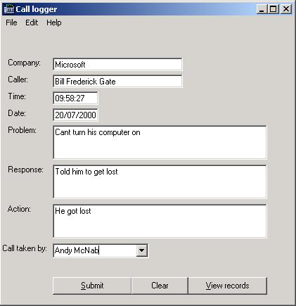



## Call Logger

### Description

This is a program to record callers to a helpdesk. It uses a very good example of records, if you are looking for how to create records then this code is for you. Special thanks to

Mark Robert Strange for his excellent flicker-free

gradient scrolling credits screen that I've incorporated into my program, hope this is helpful. Enjoy ...
 
### More Info
 

             |
---                |---
**Submitted On**   |2000-07-20 09:52:34
**By**             |[Toby Gunston](https://github.com/Planet-Source-Code/PSCIndex/blob/master/ByAuthor/toby-gunston.md)
**Level**          |Intermediate
**User Rating**    |4.0 (16 globes from 4 users)
**Compatibility**  |VB 3\.0, VB 4\.0 \(16\-bit\), VB 4\.0 \(32\-bit\), VB 5\.0, VB 6\.0, VB Script, ASP \(Active Server Pages\) 
**Category**       |[Files/ File Controls/ Input/ Output](https://github.com/Planet-Source-Code/PSCIndex/blob/master/ByCategory/files-file-controls-input-output__1-3.md)
**World**          |[Visual Basic](https://github.com/Planet-Source-Code/PSCIndex/blob/master/ByWorld/visual-basic.md)
**Archive File**   |[CODE\_UPLOAD79487202000\.zip](https://github.com/Planet-Source-Code/toby-gunston-call-logger__1-9904/archive/master.zip)

